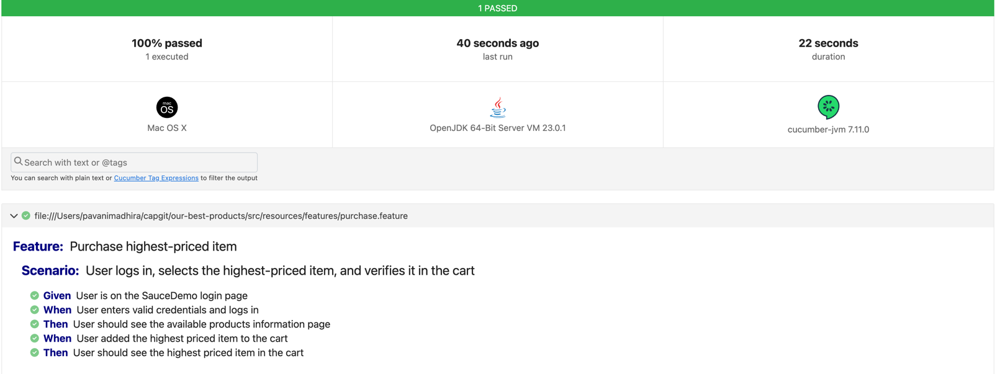

Overview:
This is a Selenium test automation framework using Cucumber, JUnit, and Maven. It automates UI testing for SauceDemo.

Prerequisites:
Java JDK 8+(I used 23)
Maven

How to Run Tests:
Clone the repository
Set browser in config.properties

Run tests using Maven:
mvn clean test

Reports:
Test reports are generated in:
target/cucumber-reports/index.html

Features:

Login Automation: Logs in using valid credentials.
Item Selection: Identifies and selects the highest-priced item.
Cart Validation: Adds the item to the cart and verifies it.
Reusable Page Objects: Uses Page Factory for efficient element management.
Singleton Driver Management: Ensures a single WebDriver instance for stability.
Cucumber BDD Approach: Uses feature files for test scenarios.
Logging with SLF4J: Logs important test steps.
HTML & JSON Reports: Generates detailed test reports.
Framework Design and Advantages

Scalability:
Modular Structure: Each component (driver, pages, tests) is separate, making it easy to add new features.
Configurable Execution: The framework supports multiple browsers through config.properties.
Maintainability
Page Object Model (POM): Reduces code duplication and improves maintainability.
Factory Pattern: Used for managing WebDriver instances and page object creation.
Centralized Config Management: Properties are stored in config.properties for easy updates.
Reusability: Common actions are encapsulated in utility functions.

Patterns Used
Page Object Model (POM): Improves test readability and maintainability.
Singleton Pattern: Ensures a single WebDriver instance for test execution.
Factory Pattern: Used in DriverFactory and PageFactoryManager to manage object creation efficiently.
Behavior-Driven Development (BDD): Cucumber feature files make tests readable and business-oriented.

Advantages:
Separation of Concerns: Keeps test logic, configuration, and execution separate.
Easy Debugging: SLF4J logs provide detailed execution insights.
Cross-Browser Testing: Supports Chrome, Firefox, and Edge.
Parallel Execution Support: Can be extended to run tests in parallel using TestNG or Cucumber options.

Extensibility: Easy to integrate with CI/CD pipelines like Jenkins.